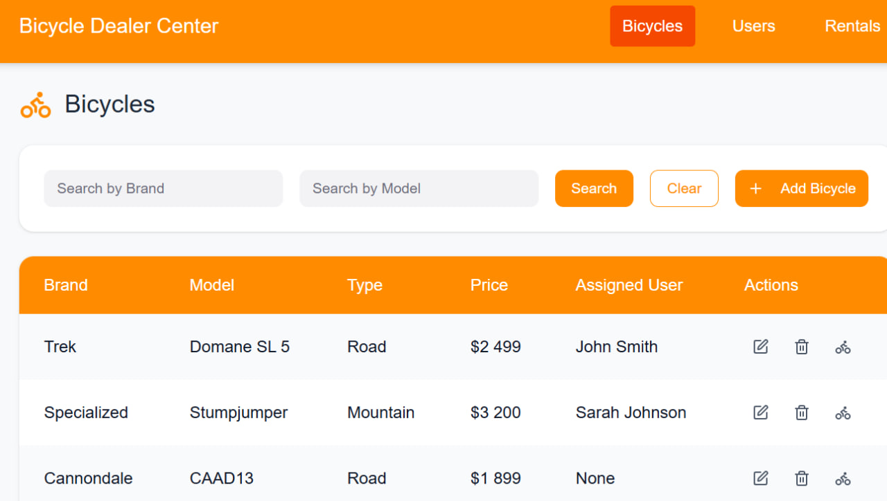
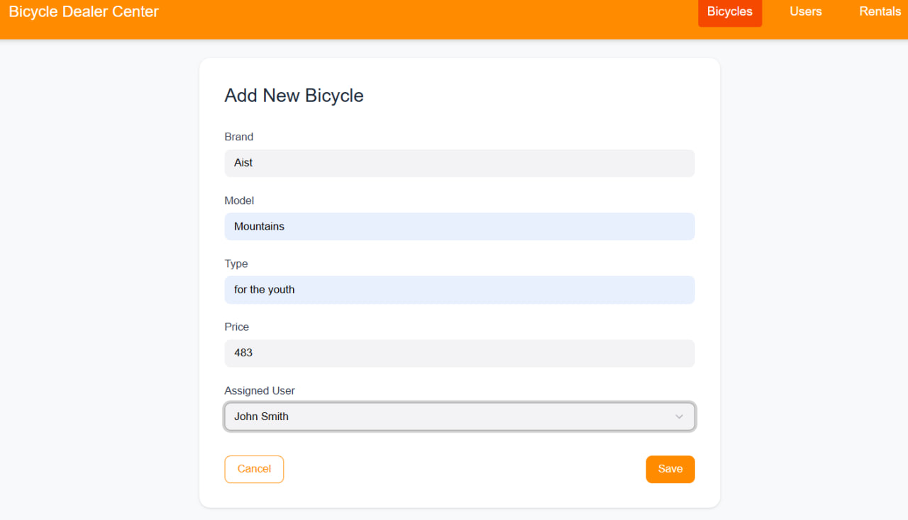
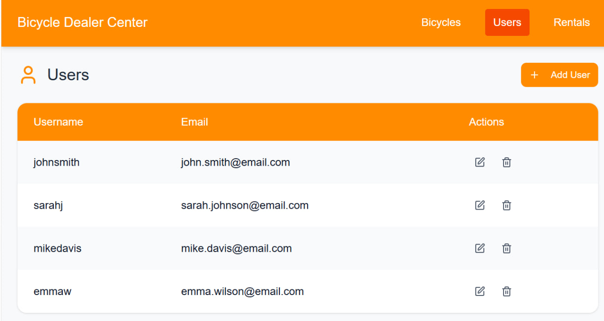
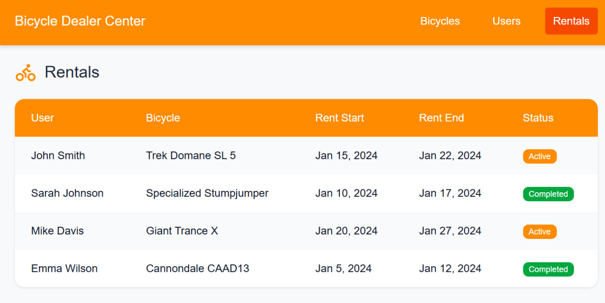
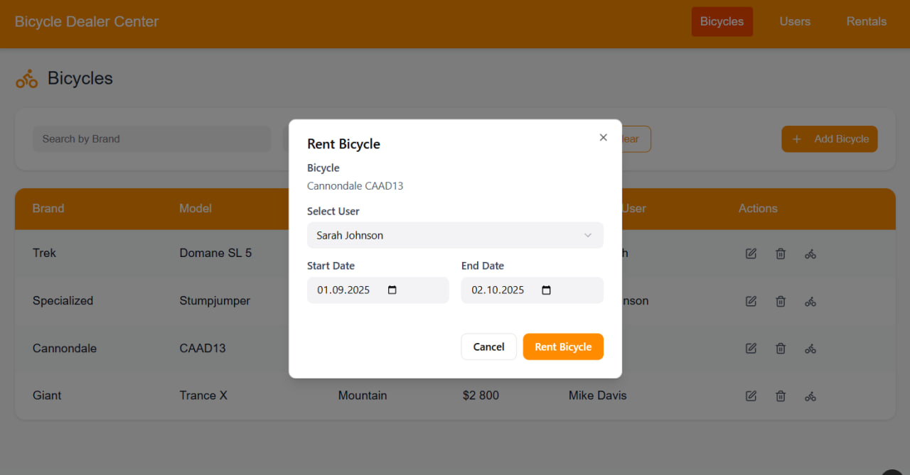
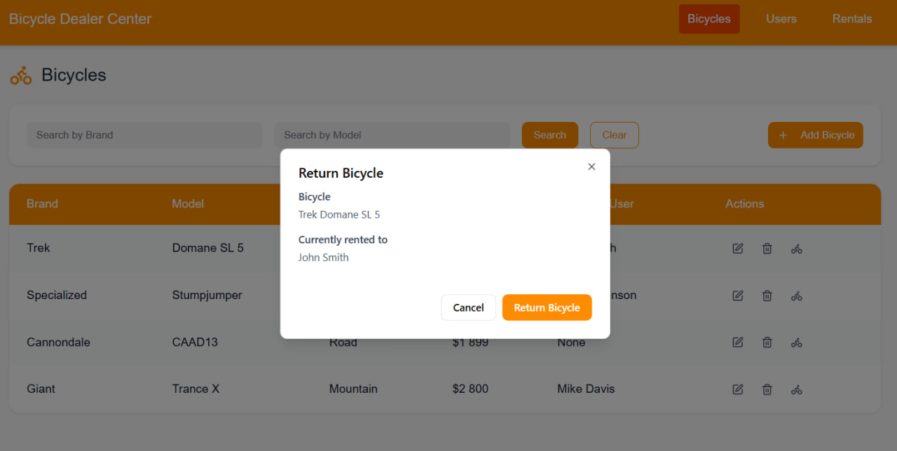

# Bicycle Dealer Center

Bicycle Dealer Center — это веб-приложение для управления парком велосипедов, пользователями и процессом аренды. Оно предоставляет интуитивно понятный интерфейс для отслеживания инвентаря, регистрации клиентов и управления арендными операциями.

## Обзор приложения

|                                                  Список велосипедов                                                   |                                              Форма добавления/редактирования                                              |                                                Список пользователей                                                |
|:---------------------------------------------------------------------------------------------------------------------:|:-------------------------------------------------------------------------------------------------------------------------:|:------------------------------------------------------------------------------------------------------------------:|
|  |  |  |


|                      Список аренд                      |                                                   Модальное окно аренды                                                   |                                                    Модальное окно возврата                                                    |
|:------------------------------------------------------:|:-------------------------------------------------------------------------------------------------------------------------:|:-----------------------------------------------------------------------------------------------------------------------------:|
|  |  |  |

## 🚀 Основные возможности

*   **Управление велосипедами (CRUD):**
    *   Добавление, просмотр, редактирование и удаление велосипедов.
    *   Поиск по бренду и модели.
*   **Управление пользователями (CRUD):**
    *   Добавление, просмотр, редактирование и удаление пользователей.
*   **Система аренды:**
    *   Возможность назначать велосипед пользователю (аренда).
    *   Возможность возвращать велосипед в систему.
*   **Отчетность:**
    *   Просмотр активных и завершенных аренд в отдельном разделе.

## Навигация по репозиторию:
[SRS файл программы](https://github.com/michael204060/bicycle_dialer_center_ui/blob/master/docs/SRS.md)

[Diagrams](./docs/diagrams)

[Interface images](./docs/mockups)

[Test plan](https://github.com/michael204060/bicycle_dialer_center_ui/blob/master/Test%20plan.md)

[Test results](https://github.com/michael204060/bicycle_dialer_center_ui/blob/master/Test%20results.md)

## 🛠️ Технологический стек

*   **Frontend:** React, TypeScript
*   **UI-библиотека:** Material-UI (MUI)
*   **HTTP-клиент:** Axios
*   **Навигация:** React Router
*   **Стилизация:** CSS Modules / Global CSS
*   **Backend:** Java

## ⚙️ Установка и запуск

1.  **Клонируйте репозиторий:**
    ```bash
    git clone https://github.com/michael204060/bicycle_dealer_center_ui.git
    cd bicycle_dealer_center_ui
    ```

2.  **Установите зависимости:**
    ```bash
    npm install
    ```

3.  **Настройте API:**
    Убедитесь, что ваш бэкенд-сервер запущен и доступен по адресу `http://localhost:8080/api`. При необходимости измените `API_URL` в `src/api/bicycleApi.ts`.

4.  **Запустите приложение:**
    ```bash
    npm start
    ```
    Приложение будет доступно по адресу `http://localhost:3000`.