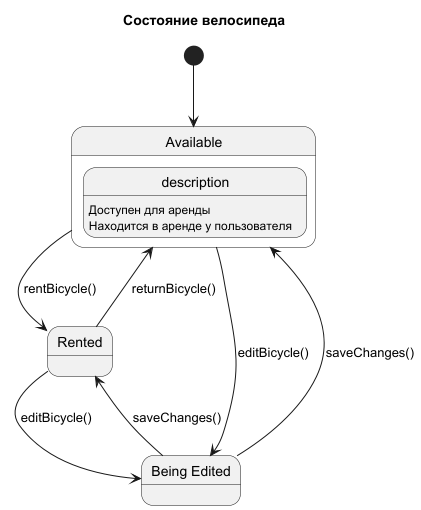
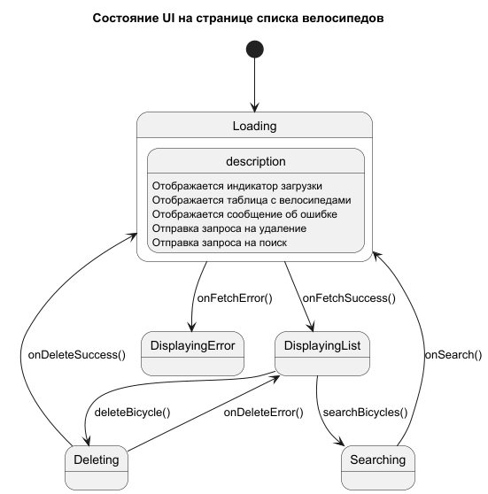

# Диаграммы состояний "Bicycle Dealer Center"

### 1. Состояние объекта "Велосипед" (Bicycle)

Эта диаграмма показывает жизненный цикл велосипеда в системе.

### 2. Состояние интерфейса на странице "Список велосипедов"

Эта диаграмма детализирует состояния пользовательского интерфейса при взаимодействии со списком.

